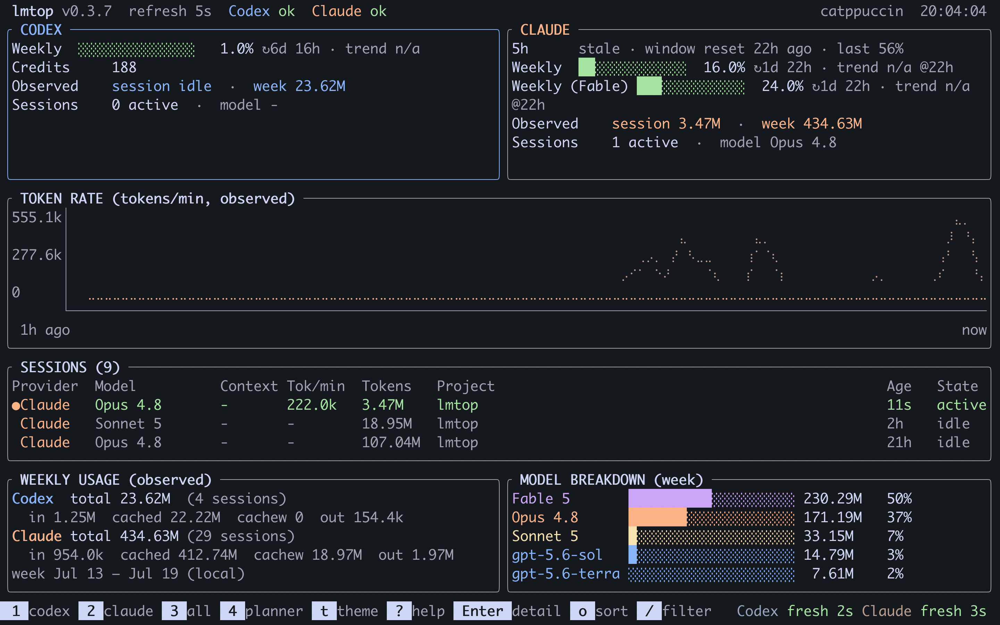
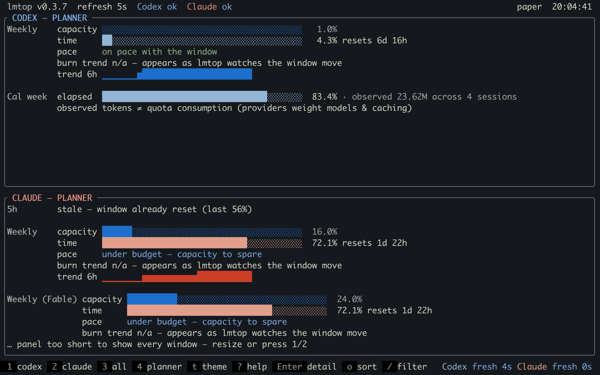

# lmtop

**lmtop is a live terminal monitor for language-model usage, quotas, and
subscription capacity.**

lmtop ("language-model top", lowercase like `top`, `htop`, and `btop`) is a
Rust/Ratatui terminal dashboard for monitoring usage, rate limits, rolling
quota windows, reset times, burn velocity, and projected exhaustion across
AI coding agents such as OpenAI Codex and Claude Code. It is designed
especially for users on flat-rate subscription plans rather than API-only
billing.

Most tools in this space are token-cost trackers (what did my API usage
cost?) or process inspectors (what is running?). lmtop answers a different
question — **subscription capacity planning**:

- **How much subscription capacity remains?**
- **When does each quota reset?**
- **How quickly is capacity being consumed?**
- **Am I likely to exhaust it before the reset?**



*Combined view: provider quota windows with reset countdowns, observed
token rate, live sessions, and the weekly model breakdown.*



*Planner view (key `4`): every quota window races capacity used against
time elapsed, so "will it last?" is answered at a glance.*

> lmtop is an independent open-source project. It is not affiliated with,
> sponsored by, or endorsed by OpenAI or Anthropic.

## What it shows

Three concepts, kept strictly separate:

| Concept | Source | Meaning |
|---|---|---|
| **Observed tokens** | local session metadata | what your agents actually consumed, by session / calendar week / model |
| **Provider quota** | provider-reported percentages | authoritative subscription window usage (5-hour, weekly), with reset times |
| **Estimated API cost** | — | not implemented; would be hypothetical only |

Flat-rate providers apply hidden weights, caching rules, and model
multipliers — so observed tokens are **never** converted into quota
percentages, and quota percentages are never converted into token counts.

On top of the provider-reported quota trend it computes **burn velocity**
(percentage points per hour) and a **projected exhaustion time**, and
answers the question that matters: *will this window run out before it
resets?* (`✓ lasts` / `⚠ empty ~1h40m` / `✗ exhausted`).

It also distinguishes **calendar weeks** (Monday-start by default,
configurable, local timezone) from provider **rolling quota windows** — a
"weekly" quota window is a rolling 7 days, not your calendar week, and is
never labeled as one.

## Supported providers and capabilities

| Capability | Codex | Claude Code |
|---|---|---|
| local_token_usage | ✅ | ✅ |
| active_session | ✅ | ✅ |
| calendar_week_aggregation | ✅ | ✅ |
| model_breakdown | ✅ | ✅ |
| provider_quota | ✅ (local rate-limit snapshots, or live with `--live`) | ✅ (Claude Code's local quota cache, or live with `--live`) |
| credits | ✅ (when reported; always with `--live`) | ❌ |
| reset_times | ✅ | ✅ |
| model-scoped limits | ❌ (not reported) | ✅ (e.g. a per-model weekly cap) |
| history | ✅ | ✅ |

Unavailable capabilities are shown as *unavailable*, never invented. See
`docs/data-sources.md` for exactly where each number comes from and
`docs/privacy.md` for what is never read.

## Install

### Homebrew (macOS, Linux)

```bash
brew install ewijaya/tap/lmtop
```

### Debian / Ubuntu (apt)

One-time setup — enroll the signing key and repository:

```bash
curl -fsSL https://ewijaya.github.io/apt/lmtop.gpg \
  | sudo tee /usr/share/keyrings/lmtop.gpg > /dev/null
echo "deb [arch=amd64,arm64 signed-by=/usr/share/keyrings/lmtop.gpg] https://ewijaya.github.io/apt stable main" \
  | sudo tee /etc/apt/sources.list.d/lmtop.list
```

Then install — and later upgrades arrive with ordinary `apt upgrade`:

```bash
sudo apt update && sudo apt install lmtop
```

The packages contain the same statically linked binaries as the release
tarballs, so they install on any Debian or Ubuntu version with no
dependencies. Prefer not to add a repository? Each release also attaches
standalone `.deb` files:

```bash
sudo apt install ./lmtop_*_$(dpkg --print-architecture).deb
```

> lmtop is not in Debian or Ubuntu's own archives — `apt install lmtop`
> works via the repository above, which tracks releases here immediately
> instead of waiting on a distribution's package review and freeze cycle.

### Pre-built binary

Download a tarball for your platform from the
[latest release](https://github.com/ewijaya/lmtop/releases/latest), then:

```bash
tar -xzf lmtop-*-$(uname -m)-*.tar.gz
sudo install -m755 lmtop-*/lmtop /usr/local/bin/lmtop
```

Checksums for every archive are published as `SHA256SUMS` on the release.

### From source

Stable Rust required ([rustup](https://rustup.rs)):

```bash
git clone https://github.com/ewijaya/lmtop
cd lmtop
cargo install --path . --locked
lmtop
```

`cargo install` places the binary in `~/.cargo/bin`, which rustup already
put on your `PATH` — so `lmtop` runs from any directory, like `top` or
`htop`. (Homebrew and the pre-built binary installs above are also global.)

If you prefer a plain build without installing, `cargo build --release`
produces `./target/release/lmtop`; make that global with:

```bash
sudo install -m755 target/release/lmtop /usr/local/bin/lmtop
```

## Usage

```bash
lmtop                     # combined dashboard
lmtop --live              # + live quota from the providers (opt-in network)
lmtop --provider codex    # Codex only
lmtop --provider claude   # Claude only
lmtop --offline           # never touch the network
lmtop --refresh 5         # rescan every 5 seconds
lmtop --ascii             # ASCII bars/charts
lmtop snapshot            # one-shot text summary (non-interactive)
lmtop snapshot --json     # machine-readable snapshot
lmtop line                # one-line summary for status bars (tmux, starship…)
lmtop doctor              # discovery, parse health, capabilities
lmtop --version
```

### Status-bar embedding (`lmtop line`)

`lmtop line` prints a single colored line — per provider, every quota
window plus the worst outlook marker — and exits:

```text
Codex wk 42% · Claude 5h 26% wk 13% wk·Fable 19%
```

Drop it into tmux (`set -g status-right '#(lmtop line --color)'`), a
starship custom command, a waybar module, or a Claude Code statusline.
Colors are only emitted when stdout is a terminal unless `--color` forces
them; `--plain` strips them.

### Live quota (`--live`)

By default lmtop is local-first: quota comes from files the provider CLIs
write, so it is only as fresh as your last agent activity **on this
machine** — usage from another device is invisible until then. With
`--live` (or `network_quota = true` per provider in the config) lmtop asks
the same usage endpoints the CLIs' own status screens use, authenticated
with the access token each CLI already stores locally. That keeps the
dashboard in sync with what `claude` `/usage` and the Codex banner report,
including Codex credits. The token is read for the request header and
nothing else — never logged, stored, or sent elsewhere (`docs/privacy.md`
has the exact contract). `--offline` always wins over `--live`.

## Keyboard shortcuts

```text
1        Codex view              j/k ↓↑ Move session cursor
2        Claude view             Enter  Session detail overlay
3        Combined view           o / O  Cycle / reverse session sort
4        Planner view            /      Filter sessions (Esc clears)
Tab      Change focused panel    v      Rate ⇄ quota timeline chart
s        Focus sessions          ←/→    Pan chart back through history
m        Focus model breakdown   +/-    Zoom chart window
w        Focus weekly usage      0      Back to the live edge
h        Focus history chart     r      Refresh now
p        Pause collectors        ?      Help
q        Quit                    Esc    Close / clear / quit
```

The mouse works too: click to focus a panel, click a session to select it
(again to open its detail), click the table header to change sort, and
scroll to move through sessions or pan the chart.

## Planner view (key 4)

The planner answers "will it last?" head-on: for every quota window it
races **capacity used** against **time elapsed**, shows the current burn
rate next to the *sustainable* burn rate (what you could spend per hour
and still make the reset), projects the percentage you'll reach at reset,
and plots a 6-hour quota trend sparkline — plus calendar-week pacing from
observed tokens (clearly labeled, never conflated with quota).

## History & the quota sawtooth

With persistence on (the default), lmtop records per-minute token rates
and every quota change to `~/.local/share/lmtop/history.jsonl` (30 days,
pruned automatically). The chart panel can then pan (`←/→`) and zoom
(`+/-`) back through past days, and `v` switches it to the **quota
timeline** — the drain-and-reset sawtooth of each window over time.
History accumulates while lmtop runs; sessions parsed from provider logs
also backfill the rate history.

## Alerts

lmtop rings the terminal bell and sends a desktop notification when a
quota window crosses 80% / 95%, or when projected exhaustion lands within
30 minutes *before* the window resets. Thresholds, channels, and an
arbitrary command hook are configurable (`[alerts]` in the config); each
alert fires once per window occurrence and re-arms after the reset. Alerts
are never raised from data older than an hour.

## Themes

45 themes ship in the binary: the curated `dark`, `light`, `catppuccin`,
`gruvbox`, and `nord` palettes, plus btop's entire theme collection
(`dracula`, `tokyo-night`, `onedark`, `everforest-dark-medium`,
`solarized_light`, … — see `themes/`) converted by
`scripts/btop2lmtop.py`. Pick one with `theme = "<name>"` in the config,
or cycle live with `t` / `T` (the header shows the current name; set
`ui.theme` to keep it).

The btop conversions map structural colors directly, but lmtop's semantic
roles (good/warn/bad, provider and model accents) don't exist in btop, so
those are derived mechanically by nearest hue — coherent, not
hand-curated.

Add your own at `~/.config/lmtop/themes/<name>.toml` (any subset of the
roles in a shipped file; unset roles keep the dark palette's colors). A
user theme named like a shipped one replaces it. Truecolor terminals get
the full palette (including continuous green→amber→red gauge blending);
16-color terminals fall back to ANSI, where every theme looks the same.

## Custom providers

Any provider lmtop has no built-in collector for — Gemini, Ollama,
OpenRouter, an internal gateway — can be wired in through
`[providers.custom]`: point it at a JSON file or a command emitting a
small documented schema (sessions with cumulative token counters, quota
windows, credits), and it gets the full treatment: panels, sessions,
week aggregation, burn trends. See `docs/configuration.md`.

## Flat-rate subscription limitations

Honesty section — read this before trusting any number:

- **Codex quota** (without `--live`) comes from rate-limit snapshots that
  the Codex CLI writes into its own session logs. They are authoritative
  but only as fresh as your last Codex activity on this machine; if you
  haven't used Codex for hours, the quota shown is hours old (freshness is
  displayed). Use `--live` for current numbers.
- **Newer Codex CLIs (≥ ~0.144) are migrating storage** from rollout JSONL
  files to a SQLite state database. lmtop reads both: sessions found only
  in the state DB appear with their token totals as *unattributed* (the DB
  has no input/output split) and carry no rate-limit snapshots — the
  health line says so, and `--live` covers quota.
- **Claude quota** (without `--live`) comes from Claude Code's own cached
  quota view in `~/.claude.json`, refreshed only while Claude Code itself
  is running — same staleness caveat as above, and the age is displayed.
  If the cache is missing, quota is marked *unavailable* rather than
  guessed. Use `--live` for current numbers.
- **A window whose reset time has passed is shown as *stale*** (the cached
  percentage describes a finished window, not the current one), never as a
  live value.
- **Codex `--live` asks the Codex CLI itself** (a short-lived
  `codex app-server` subprocess), which reports exactly what Codex's own
  status panel shows — the direct usage endpoint sits behind bot
  protection that increasingly refuses third-party clients, and lmtop
  will not play TLS-impersonation games. Without the `codex` binary it
  falls back to that endpoint, and past that to local snapshots, saying
  so in the health line.
- **Observed tokens ≠ quota consumption.** Providers weight models, cached
  tokens, and request overhead differently and don't publish the formula.
- **Burn velocity is an extrapolation** of the provider's own recent
  percentages (a linear trend of the current monotonic run). It's a
  planning aid, not a promise.
- Quota windows are classified by their reported duration (~300 min → 5h,
  ~10 080 min → weekly). Windows with unrecognized durations are shown as
  `Window (Nm)` — unknown, but visible.

## Privacy

Local-first: no network calls, no telemetry, no API keys, no credential
reads, no prompt content — collectors parse token counts and identifiers
from session metadata and nothing else. The one exception is the opt-in
`--live` quota fetch described above, which reads each CLI's stored access
token solely to call that provider's own usage endpoint. Full model:
`docs/privacy.md`.

## Platform status

| Platform | Status |
|---|---|
| Linux | primary — developed and smoke-tested here |
| macOS | expected to work (crossterm + platform dirs); untested |
| Windows | expected to work; untested |
| WSL / SSH | works — plain terminal I/O, ASCII fallback available |

## Documentation

- `docs/architecture.md` — layers, data flow, design decisions
- `docs/data-sources.md` — exact provider schemas consumed
- `docs/privacy.md` — the privacy contract
- `docs/configuration.md` — config file reference
- `docs/releasing.md` — how releases and the Homebrew tap are published
- `CONTRIBUTING.md` — development guide

## License

MIT — see `LICENSE`.
