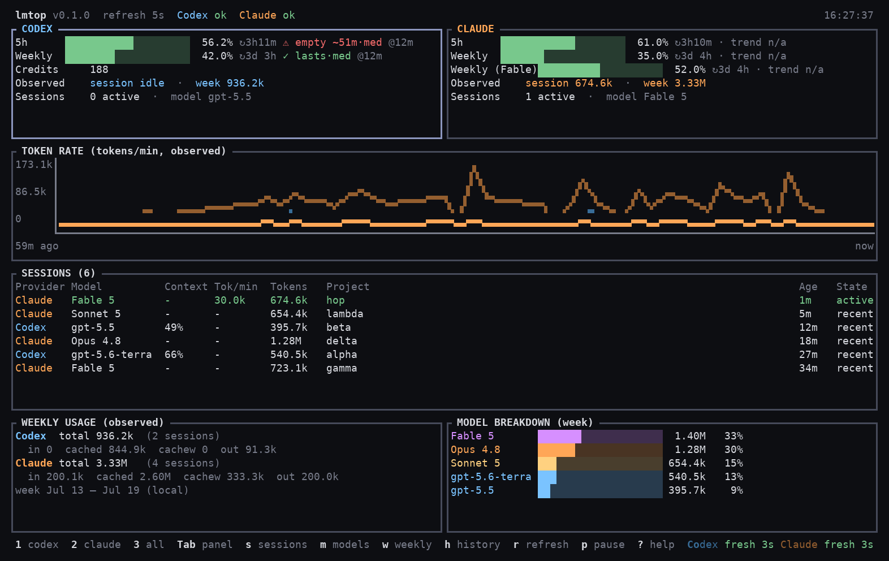

# lmtop

**lmtop is a live terminal monitor for language-model usage, quotas, and
subscription capacity.**

lmtop ("language-model top", lowercase like `top`, `htop`, and `btop`) is a
Rust/Ratatui terminal dashboard for monitoring usage, rate limits, rolling
quota windows, reset times, burn velocity, and projected exhaustion across
AI coding agents such as OpenAI Codex and Claude Code. It is designed
especially for users on flat-rate subscription plans rather than API-only
billing.

Most tools in this space are token-cost trackers (what did my API usage
cost?) or process inspectors (what is running?). lmtop answers a different
question — **subscription capacity planning**:

- **How much subscription capacity remains?**
- **When does each quota reset?**
- **How quickly is capacity being consumed?**
- **Am I likely to exhaust it before the reset?**



*Combined view. Data shown is synthetic (from `tests/fixtures/`), so no real
project names or usage appear.*

> lmtop is an independent open-source project. It is not affiliated with,
> sponsored by, or endorsed by OpenAI or Anthropic.

## What it shows

Three concepts, kept strictly separate:

| Concept | Source | Meaning |
|---|---|---|
| **Observed tokens** | local session metadata | what your agents actually consumed, by session / calendar week / model |
| **Provider quota** | provider-reported percentages | authoritative subscription window usage (5-hour, weekly), with reset times |
| **Estimated API cost** | — | not implemented; would be hypothetical only |

Flat-rate providers apply hidden weights, caching rules, and model
multipliers — so observed tokens are **never** converted into quota
percentages, and quota percentages are never converted into token counts.

On top of the provider-reported quota trend it computes **burn velocity**
(percentage points per hour) and a **projected exhaustion time**, and
answers the question that matters: *will this window run out before it
resets?* (`✓ lasts` / `⚠ empty ~1h40m` / `✗ exhausted`).

It also distinguishes **calendar weeks** (Monday-start by default,
configurable, local timezone) from provider **rolling quota windows** — a
"weekly" quota window is a rolling 7 days, not your calendar week, and is
never labeled as one.

## Supported providers and capabilities

| Capability | Codex | Claude Code |
|---|---|---|
| local_token_usage | ✅ | ✅ |
| active_session | ✅ | ✅ |
| calendar_week_aggregation | ✅ | ✅ |
| model_breakdown | ✅ | ✅ |
| provider_quota | ✅ (local rate-limit snapshots, or live with `--live`) | ✅ (Claude Code's local quota cache, or live with `--live`) |
| credits | ✅ (when reported; always with `--live`) | ❌ |
| reset_times | ✅ | ✅ |
| model-scoped limits | ❌ (not reported) | ✅ (e.g. a per-model weekly cap) |
| history | ✅ | ✅ |

Unavailable capabilities are shown as *unavailable*, never invented. See
`docs/data-sources.md` for exactly where each number comes from and
`docs/privacy.md` for what is never read.

## Install

### Homebrew (macOS, Linux)

```bash
brew install ewijaya/tap/lmtop
```

### Pre-built binary

Download a tarball for your platform from the
[latest release](https://github.com/ewijaya/lmtop/releases/latest), then:

```bash
tar -xzf lmtop-*-$(uname -m)-*.tar.gz
sudo install -m755 lmtop-*/lmtop /usr/local/bin/lmtop
```

Checksums for every archive are published as `SHA256SUMS` on the release.

### From source

Stable Rust required ([rustup](https://rustup.rs)):

```bash
git clone https://github.com/ewijaya/lmtop
cd lmtop
cargo install --path . --locked
lmtop
```

`cargo install` places the binary in `~/.cargo/bin`, which rustup already
put on your `PATH` — so `lmtop` runs from any directory, like `top` or
`htop`. (Homebrew and the pre-built binary installs above are also global.)

If you prefer a plain build without installing, `cargo build --release`
produces `./target/release/lmtop`; make that global with:

```bash
sudo install -m755 target/release/lmtop /usr/local/bin/lmtop
```

> **Not packaged in `apt`.** `apt install lmtop` resolves against Debian and
> Ubuntu's own archives, which requires a maintainer to sponsor the package
> through their review process — and would then ship a version well behind
> this repository. Use Homebrew or a release binary instead.

## Usage

```bash
lmtop                     # combined dashboard
lmtop --live              # + live quota from the providers (opt-in network)
lmtop --provider codex    # Codex only
lmtop --provider claude   # Claude only
lmtop --offline           # never touch the network
lmtop --refresh 5         # rescan every 5 seconds
lmtop --ascii             # ASCII bars/charts
lmtop snapshot            # one-shot text summary (non-interactive)
lmtop snapshot --json     # machine-readable snapshot
lmtop doctor              # discovery, parse health, capabilities
lmtop --version
```

### Live quota (`--live`)

By default lmtop is local-first: quota comes from files the provider CLIs
write, so it is only as fresh as your last agent activity **on this
machine** — usage from another device is invisible until then. With
`--live` (or `network_quota = true` per provider in the config) lmtop asks
the same usage endpoints the CLIs' own status screens use, authenticated
with the access token each CLI already stores locally. That keeps the
dashboard in sync with what `claude` `/usage` and the Codex banner report,
including Codex credits. The token is read for the request header and
nothing else — never logged, stored, or sent elsewhere (`docs/privacy.md`
has the exact contract). `--offline` always wins over `--live`.

## Keyboard shortcuts

```text
1        Codex view              w      Focus weekly usage
2        Claude view             h      Focus history chart
3        Combined view           j/k ↓↑ Scroll sessions
Tab      Change focused panel    r      Refresh now
s        Focus sessions          p      Pause / resume collectors
m        Focus model breakdown   ?      Help
                                 q/Esc  Quit
```

## Flat-rate subscription limitations

Honesty section — read this before trusting any number:

- **Codex quota** (without `--live`) comes from rate-limit snapshots that
  the Codex CLI writes into its own session logs. They are authoritative
  but only as fresh as your last Codex activity on this machine; if you
  haven't used Codex for hours, the quota shown is hours old (freshness is
  displayed). Use `--live` for current numbers.
- **Claude quota** (without `--live`) comes from Claude Code's own cached
  quota view in `~/.claude.json`, refreshed only while Claude Code itself
  is running — same staleness caveat as above, and the age is displayed.
  If the cache is missing, quota is marked *unavailable* rather than
  guessed. Use `--live` for current numbers.
- **A window whose reset time has passed is shown as *stale*** (the cached
  percentage describes a finished window, not the current one), never as a
  live value.
- **Codex `--live` can be refused**: the usage endpoint sits behind bot
  protection that occasionally answers 403. lmtop backs off, says so in
  the health line, and falls back to the local snapshots.
- **Observed tokens ≠ quota consumption.** Providers weight models, cached
  tokens, and request overhead differently and don't publish the formula.
- **Burn velocity is an extrapolation** of the provider's own recent
  percentages (a linear trend of the current monotonic run). It's a
  planning aid, not a promise.
- Quota windows are classified by their reported duration (~300 min → 5h,
  ~10 080 min → weekly). Windows with unrecognized durations are shown as
  `Window (Nm)` — unknown, but visible.

## Privacy

Local-first: no network calls, no telemetry, no API keys, no credential
reads, no prompt content — collectors parse token counts and identifiers
from session metadata and nothing else. The one exception is the opt-in
`--live` quota fetch described above, which reads each CLI's stored access
token solely to call that provider's own usage endpoint. Full model:
`docs/privacy.md`.

## Platform status

| Platform | Status |
|---|---|
| Linux | primary — developed and smoke-tested here |
| macOS | expected to work (crossterm + platform dirs); untested |
| Windows | expected to work; untested |
| WSL / SSH | works — plain terminal I/O, ASCII fallback available |

## Documentation

- `docs/architecture.md` — layers, data flow, design decisions
- `docs/data-sources.md` — exact provider schemas consumed
- `docs/privacy.md` — the privacy contract
- `docs/configuration.md` — config file reference
- `docs/releasing.md` — how releases and the Homebrew tap are published
- `CONTRIBUTING.md` — development guide

## License

MIT — see `LICENSE`.
